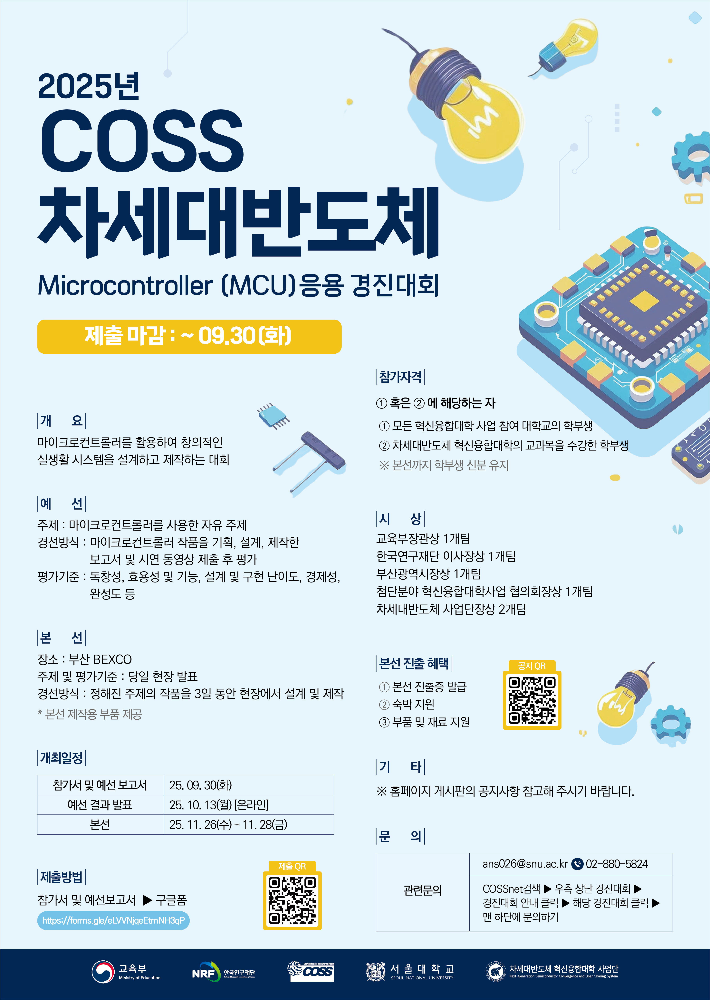

# 2025 COSS MCU Contest

<p align="center">
  Archive of our work for the 2025 COSS Next Semiconductor MCU Application Contest<br />
  Built by <strong>Hong Baksa and Kids</strong> across Day 1 and Day 2 challenges.
</p>

<p align="center">
  <a href="./poster.png">
    
  </a>
</p>

<p align="center">
  Quick Links<br />
  <a href="./홍박사와%20아이들%201일차%20과제/과제%20A/홍박사와%20아이들%20과제%20A%20시연%20영상.mp4">Day 1 Demo A</a>
  ·
  <a href="./홍박사와%20아이들%201일차%20과제/과제%20B/홍박사와%20아이들과제%20B%20시연%20영상.mp4">Day 1 Demo B</a>
  ·
  <a href="./홍박사와%20아이들%202일차%20과제/AVR/홍박사와아이들%201일차%20시연영상_AVR.mp4">Day 2 AVR Demo</a>
  ·
  <a href="./홍박사와%20아이들%202일차%20과제/STM/2일차%20시연영상_STM32.mp4">Day 2 STM32 Demo</a>
</p>

This repository collects four MCU projects built with ATtiny85, AVR, and STM32.
It is organized as a compact contest portfolio, with source code, reports, circuit diagrams,
and demo videos kept together so each result can be reviewed in one place.

## At a Glance

| Day | Project | Platform | Focus | Quick Links |
| --- | --- | --- | --- | --- |
| Day 1 A | Stopwatch / Bomb Timer | ATtiny85 + TM1650 | 7-segment display, button input, buzzer, LED, timer interrupts | [Code](./홍박사와%20아이들%201일차%20과제/과제%20A/main.c) / [Report](./홍박사와%20아이들%201일차%20과제/과제%20A/홍박사와%20아이들%20과제%20A%20보고서.pdf) / [Demo](./홍박사와%20아이들%201일차%20과제/과제%20A/홍박사와%20아이들%20과제%20A%20시연%20영상.mp4) |
| Day 1 B | Hotel Safe | ATtiny85 + TM1650 | Password input, lock state machine, audio feedback, success/error interaction | [Code](./홍박사와%20아이들%201일차%20과제/과제%20B/main.c) / [Report](./홍박사와%20아이들%201일차%20과제/과제%20B/홍박사와%20아이들%20과제%20B%20보고서.pdf) / [Demo](./홍박사와%20아이들%201일차%20과제/과제%20B/홍박사와%20아이들과제%20B%20시연%20영상.mp4) |
| Day 2 AVR | HUB75 LED Tetris | AVR + Dual HUB75 64x32 | Virtual 64x64 rendering, game logic, scoring effects, PWM scan loop | [Code](./홍박사와%20아이들%202일차%20과제/AVR/main.c) / [Report](./홍박사와%20아이들%202일차%20과제/AVR/홍박사와%20아이들%202일차%20AVR%20보고서.pdf) / [Demo](./홍박사와%20아이들%202일차%20과제/AVR/홍박사와아이들%201일차%20시연영상_AVR.mp4) |
| Day 2 STM32 | LED MATRIX - Night of Gwangalli | STM32 + HUB75 Panel | Fireworks animation, background composition, traffic overlay, PWM sound | [Code](./홍박사와%20아이들%202일차%20과제/STM/소스파일/main.c) / [Report](./홍박사와%20아이들%202일차%20과제/STM/홍박사와%20아이들%202일차%20STM32%20보고서.pdf) / [Demo](./홍박사와%20아이들%202일차%20과제/STM/2일차%20시연영상_STM32.mp4) |

## Highlights

### Day 1 - ATtiny85 Projects

#### 1) Stopwatch / Bomb Timer

This project uses an ATtiny85 and a TM1650 4-digit 7-segment module to build a dual-mode timer.
It switches between a standard stopwatch mode and a bomb timer mode, while handling 0.1-second timing,
button-based state transitions, buzzer warnings, and LED feedback.

- Key points
  - Timer0-based 1 ms system timer
  - Timer1 PWM buzzer output
  - Software I2C control for the TM1650
  - Dedicated countdown and melody logic for bomb mode

- Links
  - [Source Code](./홍박사와%20아이들%201일차%20과제/과제%20A/main.c)
  - [Report](./홍박사와%20아이들%201일차%20과제/과제%20A/홍박사와%20아이들%20과제%20A%20보고서.pdf)
  - [Circuit Diagram](./홍박사와%20아이들%201일차%20과제/과제%20A/홍박사와%20아이들%20과제%20A%20회로도.pdf)
  - [Demo Video](./홍박사와%20아이들%201일차%20과제/과제%20A/홍박사와%20아이들%20과제%20A%20시연%20영상.mp4)

#### 2) Hotel Safe

This project turns an ATtiny85 and TM1650 keypad/display setup into a 4-digit password safe.
It focuses on password checking, setting mode, repeated failure tracking, a 10-second lock state,
and responsive audio and display feedback for success and error cases.

- Key points
  - Password input and edit state management
  - Lock countdown after four failed attempts
  - Interrupt-driven asynchronous sound system
  - Segment animation for success and failure feedback

- Links
  - [Source Code](./홍박사와%20아이들%201일차%20과제/과제%20B/main.c)
  - [Report](./홍박사와%20아이들%201일차%20과제/과제%20B/홍박사와%20아이들%20과제%20B%20보고서.pdf)
  - [Circuit Diagram](./홍박사와%20아이들%201일차%20과제/과제%20B/홍박사와%20아이들%20과제%20B%20회로도.pdf)
  - [Demo Video](./홍박사와%20아이들%201일차%20과제/과제%20B/홍박사와%20아이들과제%20B%20시연%20영상.mp4)

### Day 2 - Display Projects

#### 3) HUB75 LED Tetris (AVR)

This AVR project chains two 64x32 HUB75 panels vertically to create a virtual 64x64 display
and runs a 2x-scale Tetris implementation on top of it. It includes input auto-repeat, automatic drop,
collision and line-clear handling, score effects, and GAME/END plus STAGE CLEAR rendering states.

<p align="center">
  
</p>

- Key points
  - HUB75 row-pair scan with 2-bit PWM
  - Virtual 64x64 coordinate-based rendering
  - Score-driven speed changes and stage effects
  - Lightweight game logic tuned for AVR constraints

- Links
  - [Source Code](./홍박사와%20아이들%202일차%20과제/AVR/main.c)
  - [Report](./홍박사와%20아이들%202일차%20과제/AVR/홍박사와%20아이들%202일차%20AVR%20보고서.pdf)
  - [Circuit Diagram PNG](./홍박사와%20아이들%202일차%20과제/AVR/홍박사와%20아이들%202일차%20과제%20AVR%20회로도.png)
  - [Demo Video](./홍박사와%20아이들%202일차%20과제/AVR/홍박사와아이들%201일차%20시연영상_AVR.mp4)

#### 4) LED MATRIX - Night of Gwangalli (STM32)

This visual project combines fireworks, a bridge background, moving traffic, and sound on a 128x32 LED matrix.
It is structured around TIM2 interrupt-driven panel scanning, framebuffer rendering, fireworks simulation,
and TIM3 PWM-based audio output split across several modules.

<p align="center">
  
</p>

- Key points
  - `panel.c`: HUB75 panel scanning and bit-plane PWM
  - `fireworks.c`: launch, explosion, and special-text animation logic
  - `bridge.c` / `traffic.c`: background image and moving traffic overlay
  - `sound.c`: rising and explosion sound effects

- Links
  - [Main Code](./홍박사와%20아이들%202일차%20과제/STM/소스파일/main.c)
  - [Report](./홍박사와%20아이들%202일차%20과제/STM/홍박사와%20아이들%202일차%20STM32%20보고서.pdf)
  - [Circuit Diagram PNG](./홍박사와%20아이들%202일차%20과제/STM/홍박사와%20아이들%202일차%20과제%20STM32%20회로도.png)
  - [Demo Video](./홍박사와%20아이들%202일차%20과제/STM/2일차%20시연영상_STM32.mp4)

## Repository Structure

```text
2025-COSS-MCU-Contest/
|- README.md
|- poster.png
|- 홍박사와 아이들 1일차 과제/
|  |- 과제 A/
|  |  |- main.c
|  |  |- 홍박사와 아이들 과제 A 보고서.pdf
|  |  |- 홍박사와 아이들 과제 A 회로도.pdf
|  |  `- 홍박사와 아이들 과제 A 시연 영상.mp4
|  `- 과제 B/
|     |- main.c
|     |- 홍박사와 아이들 과제 B 보고서.pdf
|     |- 홍박사와 아이들 과제 B 회로도.pdf
|     `- 홍박사와 아이들과제 B 시연 영상.mp4
`- 홍박사와 아이들 2일차 과제/
   |- AVR/
   |  |- main.c
   |  |- 홍박사와 아이들 2일차 AVR 보고서.pdf
   |  |- 홍박사와 아이들 2일차 과제 AVR 회로도.png
   |  `- 홍박사와아이들 1일차 시연영상_AVR.mp4
   `- STM/
      |- 소스파일/
      |- 헤더파일/
      |- 홍박사와 아이들 2일차 STM32 보고서.pdf
      |- 홍박사와 아이들 2일차 과제 STM32 회로도.png
      `- 2일차 시연영상_STM32.mp4
```

## Tech Notes

- The Day 1 projects focus on input, display control, sound, and state handling around `ATtiny85` and `TM1650`.
- The Day 2 AVR project explores game logic and LED panel driving under tight resource constraints.
- The Day 2 STM32 project is more modular, with timer-driven panel refresh, animation, overlay, and sound separated into dedicated files.

## Team

- Team Name: Hong Baksa and Kids
- Members: Park Gyuhyeon, Lim Songju, Song Seonghyeok, Hong Sunhyeon
